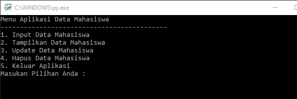

# Labspy08

### Profil
__Nama  : Nafal mumtaz fuadi__

__Nim   : 312110457__

__Kelas : T1.21.A.2__

## Class
- Ubahlah kode dibawah ini membuat Class *Class person*

```py
class mahasiswa:
    nim=""
    nama=""
    tugas=""
    uts=""
    uas=""
    akhir=""

pilih=0
datasiswa=[]
```

### Penjelasan
- Untuk membuat Class 

- 
```py
datasiswa=[]

def menu():
    system("cls")
    print("Menu Aplikasi Data Mahasiswa");
    print("-"*43)
    print("1. Input Data Mahasiswa")
    print("2. Tampilkan Data Mahasiswa")
    print("3. Update Data Mahasiswa")
    print("4. Hapus Data Mahasiswa")
    print("5. Keluar Aplikasi")
```

### Output



## Praktikum 8
> Buat program sederhana dengan mengaplikasikan penggunaan class. Buatlah
class untuk menampilkan daftar nilai mahasiswa, dengan ketentuan:
> -  Method *tambah()* untuk menambah data
> -  Medhod *tampilkan()* untuk menampilkan data
> -  Medhod *hapus(nama)* untuk menghapus data berdasarkan nama
> - Fungsi *ubah(nama)* untuk mengubah data berdasarkan nama
> - Buat diagram class, flowchart dan penjelasan programnya pada
README.md.

### Penjelasan
- Membuat yang akan diinput dengan Class
```py
class Person(): 
```

- Membuat class untuk pilihan menu
```py
 pilih= int(input("Masukan Pilihan Anda : "))
    if pilih == 1:
        pilih1()
        menu()
    elif pilih == 2:
        tampil()
        input("Kembali Menu Utama")
        menu()
```

Output Menambahkan Data


- Jika ingin menampilkan data dapat menggunakan
```py
elif pilih ==5 :
        exit()

def tampil():
    system("cls")
    print("DATA MAHASISWA")
    for data in datasiswa:
        print("Nim          : "+str(data.nim)) 
        print("Nama         : "+data.nama)
        print("Nilai Tugas  : "+str(data.tugas))
        print("Nilai UTS    : "+str(data.uts))
        print("Nilai UAS    : "+str(data.uas))
        print("Nilai Akhir  : "+str(data.akhir))
        print("-"*18)
```


- Mengubah data dapat menggunakan 
```py
  elif pilih == 3:
        index_update=-1
        tampil()
        id_edit = int(input("Input NIM yang akan diupdate "))
        for a in range(0, len(datasiswa)):
            if id_edit==datasiswa[a].nim:
                index_update=a
                break
        if (index_update > -1):
            print("INPUT DATA YANG DI UPDATE")
            siswa=mahasiswa()
            siswa.nim=(int(input("Msdukan NIM                      : ")))
            siswa.nama=(input("Masukan Nama Mahasiswa          : "))
            siswa.tugas=(float(input("Masukan Nilai Tugas              : ")))
            siswa.uts=(float(input("Masukan Nilai Uts              : ")))
            siswa.uas=(float(input("Masukan Nilai Uas              : ")))
            siswa.akhir=siswa.tugas*0.30+siswa.uts*0.35+siswa.uas*0.35
            datasiswa=[index_update]=siswa
            print("Berhasil Update Data Mahasiswa")
        else : print("NIM Tidak Ditemukan")
        input("Kembali Menu Utama")
        menu()
```


- Menghapus data dapat menggunakan
```py
 elif pilih ==4:
        system("cls")
        tampil()
        index_update=-1
        id_hapus = int(input("Input NIM Yang Akan Dihapus"))
        for a in range (0, len(data)):
            if id_hapus==datasiswa[a].nim:
                index_delete = a
                break
        if(index_delete > -1):
            del datasiswa[index_delete]
            print("Data Telah Dihapus")
        else: 
            print("NIM Tidak Ditemukan")
            input("Kembali Menu Utama")
            menu()
            menu()
```


- Mencari data dan mengulang dapat menggunakan
```py
def pilih1():
    ulang = "Y"
    while ulang in("y","Y"):
        system("cls")
        siswabaru=mahasiswa()
        print("INPUT DATA MAHASISWA")
        siswabaru.nim=(int(input("Masukan NIM            : ")))
        siswabaru.nama=(input("Masukan Nama Mahasiswa : "))
        siswabaru.tugas=(float(input("Masukan Nilai Tugas    : ")))
        siswabaru.uts=(float(input("Masukan Nilai UTS      : ")))
        siswabaru.uas=(float(input("Masukan Nilai UAS      : ")))
        siswabaru.akhir=siswabaru.tugas*0.30 + siswabaru.uts*0.35 + siswabaru.uas*0.35
        datasiswa.append(siswabaru)
        ulang=input("Apakah Anda Ingin Mengulang (Y/T)? ")
menu()
```

#### Flowchart


## Sekian dan Terima Kasih
